# Project Setup & Basic Gin Server
### Project init and installing Gin package
```
go mod init github.com/[github_user]/[package_name]
```
```
go get github.com/gin-gonic/gin
```


### server.go - basic gin server
```golang
package main

import "github.com/gin-gonic/gin"

func main() {
  // gin.Default includes Middleware like
  // Logger - output basic logs about requests
  // Recover - recover from any panics & write status 500
  server := gin.Default()
  
  // First GET Endpoint
  server.GET("/test", func(ctx *gin.Context) {
    ctx.JSON(200, gin.H{
      "message": "OK",
    })
  })

  server.Run(":9000")
}
```
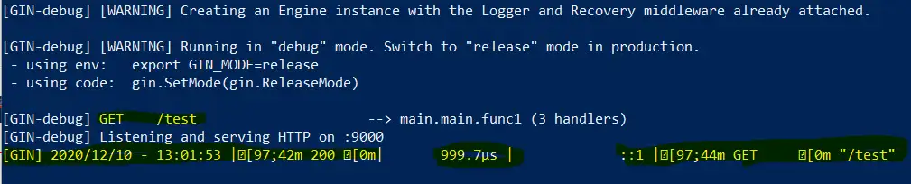
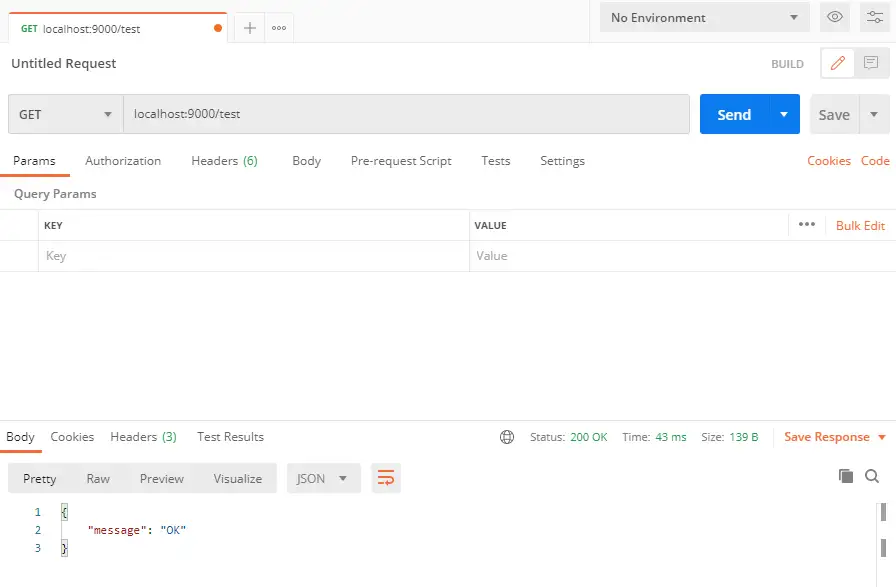


# Create first End-Points
### entity/video.go
```golang
package entity

// Video struct with JSON serialization
// to manage video content
type Video struct {
  Title       string `json:"title"`
  Description string `json:"description"`
  URL         string `json:"url"`
}
```


### service/video-service.go
```golang
package service

import "github.com/jhahspu/gogin/entity"

// VideoService interface that implements two methods to Save and Return videos
type VideoService interface {
  Save(entity.Video) entity.Video
  FindAll() []entity.Video
}

// slice of type Video
type videoService struct {
  videos []entity.Video
}

// New VideoService is a constructor that returns pointer to slice
func New() VideoService {
  return &videoService{}
}

// Save video and return it
func (service *videoService) Save(video entity.Video) entity.Video {
  service.videos = append(service.videos, video)
  return video
}

// FindAll returns a slice of videos
func (service *videoService) FindAll() []entity.Video {
  return service.videos
}
```


### controller/video-controller.go
Handlers for the HTTP Verbs GET and POST
```golang
package controller

import (
  "github.com/gin-gonic/gin"
  "github.com/jhahspu/gogin/entity"
  "github.com/jhahspu/gogin/service"
)

// VideoController has two functions for FindAll and Save videos
type VideoController interface {
  FindAll() []entity.Video
  // context needed to access the content from the http request
  Save(ctx *gin.Context) entity.Video
}

// Controller struct to implement the interface
type controller struct {
  service service.VideoService
}

// New constructor to return video controller
func New(service service.VideoService) VideoController {
  return &controller{
    service: service,
  }
}

// FindAll delegates service.FindAll
func (c *controller) FindAll() []entity.Video {
  return c.service.FindAll()
}

// Save json video and return video
func (c *controller) Save(ctx *gin.Context) entity.Video {
  var video entity.Video
  // Extract json from context
  ctx.BindJSON(&video)
  // Save & return video
  c.service.Save(video)
  return video
}
```


### update server.go
```golang
package main

import (
  "github.com/gin-gonic/gin"
  "github.com/jhahspu/gogin/controller"
  "github.com/jhahspu/gogin/service"
)

var (
  videoService    service.VideoService       = service.New()
  videoController controller.VideoController = controller.New(videoService)
)

func main() {

  // gin.Default includes Middleware like
  // Logger - output basic logs about requests
  // Recover - recover from any panics & write status 500
  server := gin.Default()
  
  server.GET("/videos", func(ctx *gin.Context) {
    ctx.JSON(200, videoController.FindAll())
  })
  server.POST("/videos", func(ctx *gin.Context) {
    ctx.JSON(200, videoController.Save(ctx))
  })
  
  server.Run(":9000")
}
```
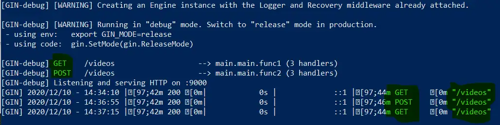
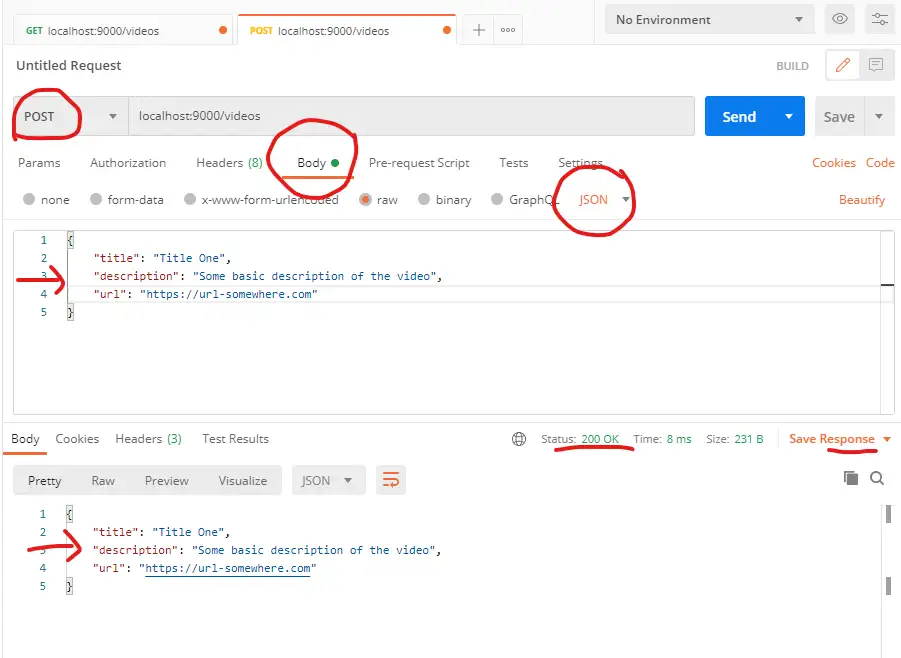
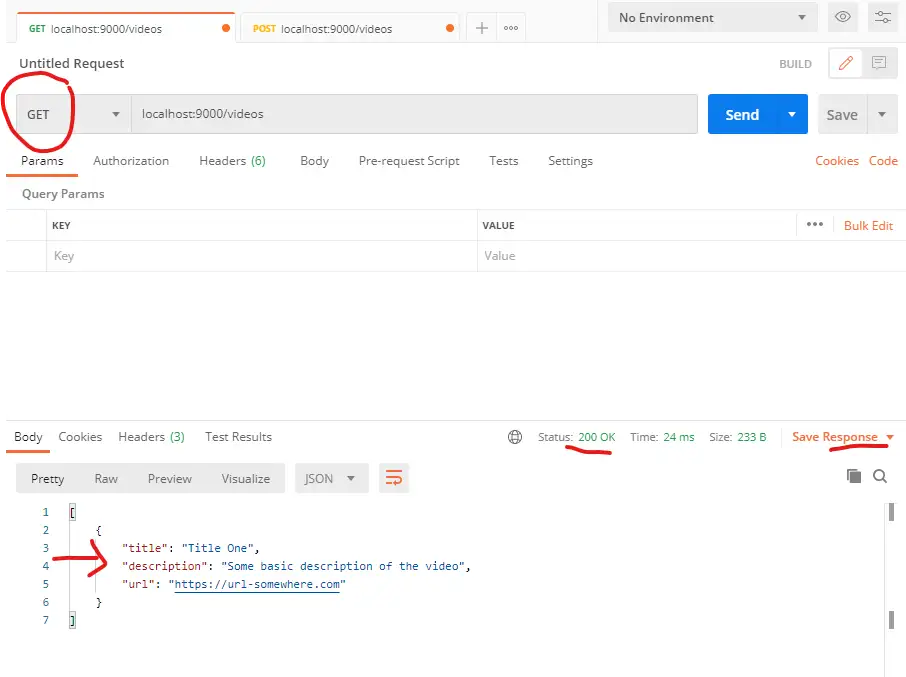


# Custom Middleware
### middleware/logger.go
```golang
package middleware

import (
  "fmt"
  "time"
  "github.com/gin-gonic/gin"
)

// Logger is a custom logger
// will return standard type expected for all middlewaress
func Logger() gin.HandlerFunc {
  return gin.LoggerWithFormatter(func(param gin.LogFormatterParams) string {
    // setup custom format
    return fmt.Sprintf(
      "%s - [%s] - %s %s %d %s \n",
      param.ClientIP,
      param.TimeStamp.Format(time.RFC822),
      param.Method,
      param.Path,
      param.StatusCode,
      param.Latency,
    )
  })
}
```


### updated server.go with custom Logger
```golang
package main
...

func main() {
  
  // create a new GIN instance
  server := gin.New()
  
  // setup Middleware
  // use standard Recovery provided by GIN
  // custom Logger from middleware
  server.Use(gin.Recovery(), middleware.Logger())
  ...
}
```
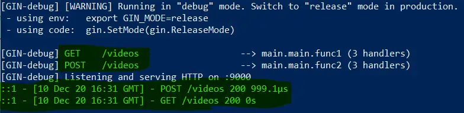
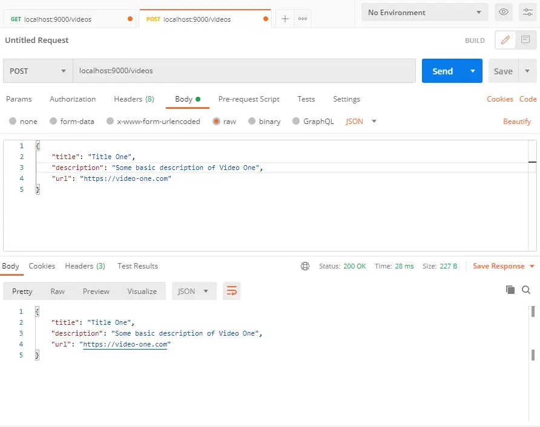
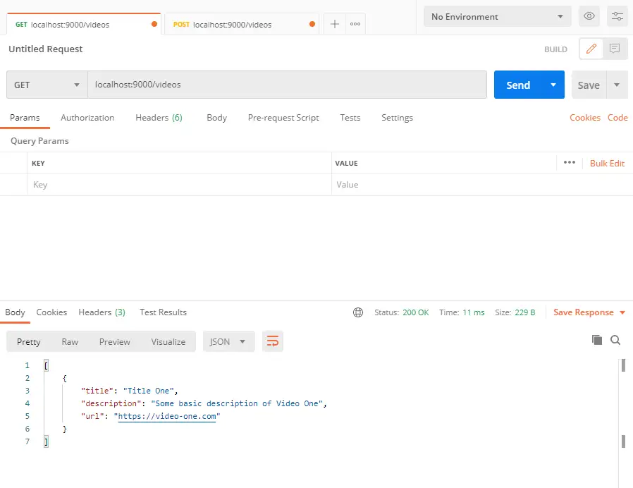


### updated server.gp with simple function to write Log to file
```golang
package main

...

// setupLogOutput to save log to file
func setupLogOutput() {
  f, _ := os.Create("gin.log")
  gin.DefaultWriter = io.MultiWriter(f, os.Stdout)
}

func main() {
  
  // write log to file
  setupLogOutput()
  ...
}
```
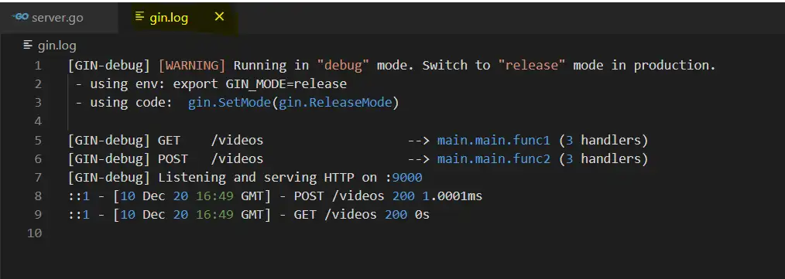


### middleware/basic-auth.go for basic authentication
```golang
package middleware

import "github.com/gin-gonic/gin"

// BasicAuth provided by gin for Basic authorization
func BasicAuth() gin.HandlerFunc {
  return gin.BasicAuth(gin.Accounts{
    // authorize a user with [username] : [password]
    "test": "test",
  })
}
```


### updated server.go with middleware for basic authentication
```golang
package main
...

func main() {
  ...
  
  // setup Middleware
  // use standard Recovery provided by GIN
  // custom Logger from middleware
  // basic authentication
  server.Use(gin.Recovery(), middleware.Logger(), middleware.BasicAuth())
  ...
}
```
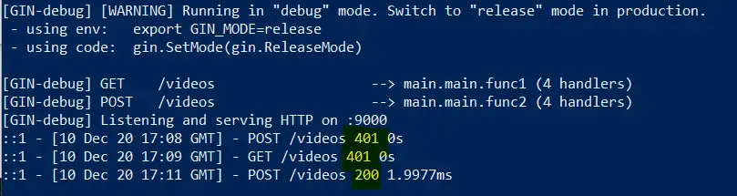
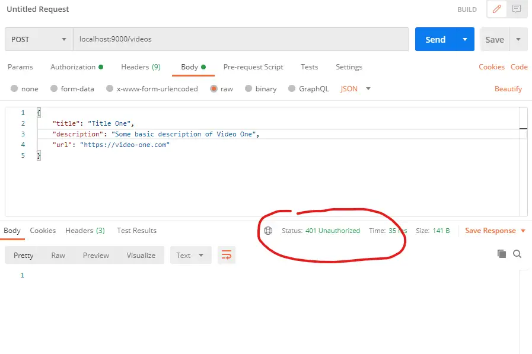


# 
### 
```golang

```
####

