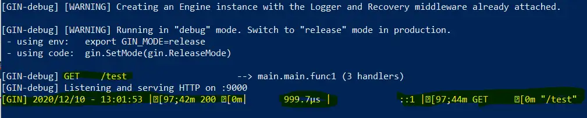
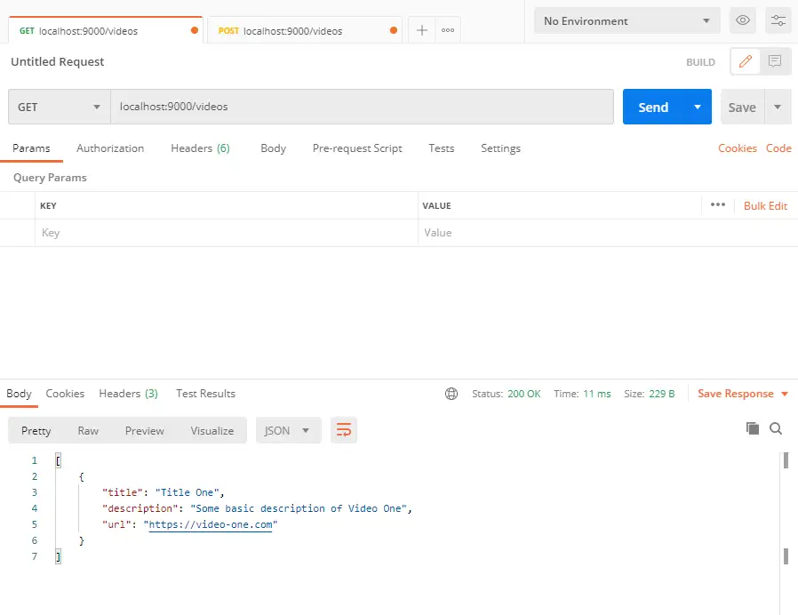
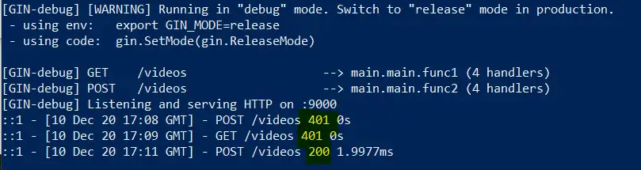

### Project Setup
#### Project init and get Gin package
```powershell
go mod init github.com/[github_user]/[package_name]

go get github.com/gin-gonic/gin
```


#####


### Basic Gin server
#### server.go
```go
package main

import "github.com/gin-gonic/gin"

func main() {
  // gin.Default includes Middleware like
  // Logger - output basic logs about requests
  // Recover - recover from any panics & write status 500
  server := gin.Default()
  
  // First GET Endpoint
  server.GET("/test", func(ctx *gin.Context) {
    ctx.JSON(200, gin.H{
      "message": "OK",
    })
  })

  server.Run(":9000")
}
```



#####


### Create first End-Points
#### entity/video.go
```go
package entity

// Video struct with JSON serialization
// to manage video content
type Video struct {
  Title       string `json:"title"`
  Description string `json:"description"`
  URL         string `json:"url"`
}
```


#### service/video-service.go
```go
package service

import "github.com/jhahspu/gogin/entity"

// VideoService interface that implements two methods to Save and Return videos
type VideoService interface {
  Save(entity.Video) entity.Video
  FindAll() []entity.Video
}

// slice of type Video
type videoService struct {
  videos []entity.Video
}

// New VideoService is a constructor that returns pointer to slice
func New() VideoService {
  return &videoService{}
}

// Save video and return it
func (service *videoService) Save(video entity.Video) entity.Video {
  service.videos = append(service.videos, video)
  return video
}

// FindAll returns a slice of videos
func (service *videoService) FindAll() []entity.Video {
  return service.videos
}
```


#### Handlers for the HTTP Verbs GET and POST
#### controller/video-controller.go
```go
package controller

import (
  "github.com/gin-gonic/gin"
  "github.com/jhahspu/gogin/entity"
  "github.com/jhahspu/gogin/service"
)

// VideoController has two functions for FindAll and Save videos
type VideoController interface {
  FindAll() []entity.Video
  // context needed to access the content from the http request
  Save(ctx *gin.Context) entity.Video
}

// Controller struct to implement the interface
type controller struct {
  service service.VideoService
}

// New constructor to return video controller
func New(service service.VideoService) VideoController {
  return &controller{
    service: service,
  }
}

// FindAll delegates service.FindAll
func (c *controller) FindAll() []entity.Video {
  return c.service.FindAll()
}

// Save json video and return video
func (c *controller) Save(ctx *gin.Context) entity.Video {
  var video entity.Video
  // Extract json from context
  ctx.BindJSON(&video)
  // Save & return video
  c.service.Save(video)
  return video
}
```


#### update server.go
```go
package main

import (
  "github.com/gin-gonic/gin"
  "github.com/jhahspu/gogin/controller"
  "github.com/jhahspu/gogin/service"
)

var (
  videoService    service.VideoService       = service.New()
  videoController controller.VideoController = controller.New(videoService)
)

func main() {

  // gin.Default includes Middleware like
  // Logger - output basic logs about requests
  // Recover - recover from any panics & write status 500
  server := gin.Default()
  
  server.GET("/videos", func(ctx *gin.Context) {
    ctx.JSON(200, videoController.FindAll())
  })
  server.POST("/videos", func(ctx *gin.Context) {
    ctx.JSON(200, videoController.Save(ctx))
  })
  
  server.Run(":9000")
}
```


#####


### Custom Middleware
#### middleware/logger.go
```go
package middleware

import (
  "fmt"
  "time"
  "github.com/gin-gonic/gin"
)

// Logger is a custom logger
// will return standard type expected for all middlewaress
func Logger() gin.HandlerFunc {
  return gin.LoggerWithFormatter(func(param gin.LogFormatterParams) string {
    // setup custom format
    return fmt.Sprintf(
      "%s - [%s] - %s %s %d %s \n",
      param.ClientIP,
      param.TimeStamp.Format(time.RFC822),
      param.Method,
      param.Path,
      param.StatusCode,
      param.Latency,
    )
  })
}
```


#### updated server.go with custom Logger
```go
package main
...

func main() {
  
  // create a new GIN instance
  server := gin.New()
  
  // setup Middleware
  // use standard Recovery provided by GIN
  // custom Logger from middleware
  server.Use(gin.Recovery(), middleware.Logger())
  ...
}
```





#### updated server.go with simple function to write Log to file
```go
package main

...

// setupLogOutput to save log to file
func setupLogOutput() {
  f, _ := os.Create("gin.log")
  gin.DefaultWriter = io.MultiWriter(f, os.Stdout)
}

func main() {
  
  // write log to file
  setupLogOutput()
  ...
}
```


#### middleware/basic-auth.go for basic authentication
```go
package middleware

import "github.com/gin-gonic/gin"

// BasicAuth provided by gin for Basic authorization
func BasicAuth() gin.HandlerFunc {
  return gin.BasicAuth(gin.Accounts{
    // authorize a user with [username] : [password]
    "test": "test",
  })
}
```


#### updated server.go with middleware for basic authentication
```go
package main
...

func main() {
  ...
  
  // setup Middleware
  // use standard Recovery provided by GIN
  // custom Logger from middleware
  // basic authentication
  server.Use(gin.Recovery(), middleware.Logger(), middleware.BasicAuth())
  ...
}
```



#####


### Data binding and Validation
#### update video.go
```go
package entity

// Person struct for informations about video author
type Person struct {
  Name  string `json:"name" binding:"required"`
  // Age required >= 12 , <=130 
	Age   int8   `json:"age" binding:"gte=12,lte=130"`
	Email string `json:"email" binding:"required,email"`
}

// Video struct with JSON serialization
type Video struct {
	Title       string `json:"title" binding:"min=5,max=100"`
	Description string `json:"description" binding:"max=255"`
	URL         string `json:"url" binding:"required,url"`
	Author      Person `json:"author" binding:"required"`
}
```


#### update controller/video-controller.go
```go
package controller

...

// Save json video or return error
func (c *controller) Save(ctx *gin.Context) error {
	var video entity.Video
	// Extract json from context
	err := ctx.ShouldBindJSON(&video)
	if err != nil {
		return err
	}
	// Save & return video
	c.service.Save(video)
	return nil
}
```


#### updated server.go
```go
package main

...

func main() {

...

	server.POST("/videos", func(ctx *gin.Context) { 
		err := videoController.Save(ctx)
		if err != nil {
			ctx.JSON(http.StatusBadRequest, gin.H{
				"error" : err.Error(),
			})
		} else {
			ctx.JSON(http.StatusOK, gin.H{"message": "Video Input Valid!"})
		}
  })
...
}
```


#### Custom validator in Video struct - video.go
```go
package entity
...
	Title       string `json:"title" binding:"min=5,max=100" validate:"lang"`
...
}
```


#### validatos/validator.go
```go
package validators

import (
	"strings"

	"github.com/go-playground/validator/v10"
)

// ValidateLangTitle is a custom validator that will return a bool
// In this case if the title of the video contains "Golang", the func will return TRUE
func ValidateLangTitle(field validator.FieldLevel) bool {
	return strings.Contains(field.Field().String(), "Golang")
}
```

#### updated Save method in controller/video-controller.go
```go
package controller

...

// Save json video or return error
func (c *controller) Save(ctx *gin.Context) error {
	var video entity.Video
	// Extract json from context
	err := ctx.ShouldBindJSON(&video)
	if err != nil {
		return err
	}
	// Custom validator
	err = validate.Struct(video)
	if err != nil {
		return err
	}
	// Save & return video
	c.service.Save(video)
	return nil
}
```


#####


### Multirouting and Templating


#### server.go
```go
package main
...

func main() {

	...

	// Static Assets for html
	server.Static("/css", "./templates/css")

	// Loading html templates
	server.LoadHTMLGlob("templates/*.html")

	...

	// Group API Endpoints
	apiRoutes := server.Group("/api")
	{
		apiRoutes.GET("/videos", func(ctx *gin.Context) {
			ctx.JSON(200, videoController.FindAll())
		})
		apiRoutes.POST("/videos", func(ctx *gin.Context) {
			err := videoController.Save(ctx)
			if err != nil {
				ctx.JSON(http.StatusBadRequest, gin.H{
					"error": err.Error(),
				})
			} else {
				ctx.JSON(http.StatusOK, gin.H{"message": "Video Input Valid!"})
			}
		})
	}

	// Group View Routes
	viewRoutes := server.Group("/videos")
	{
		viewRoutes.GET("/", videoController.ShowVideos)
	}

	server.Run(":9000")
}
```


### create templates/header -footer -index.html
#### index.html 
```html
{{ template "header.html" }}

<!-- Index Content -->
{{range .videos}}
<div class="video">
  <h2>title: {{ .Title }}</h2>
  <p>description: {{ .Description }}</p>
  <p>url: {{ .URL }}</p>
  <p>author.name: {{ .Author.Name }}</p>
  <p>author.age: {{ .Author.Age }}</p>
  <p>author.email: {{ .Author.Email }}</p>
  <div class="video-frame">
    <iframe src="{{ .URL }}"></iframe>
  </div>
</div>
{{end}}

{{ template "footer.html" }}
```